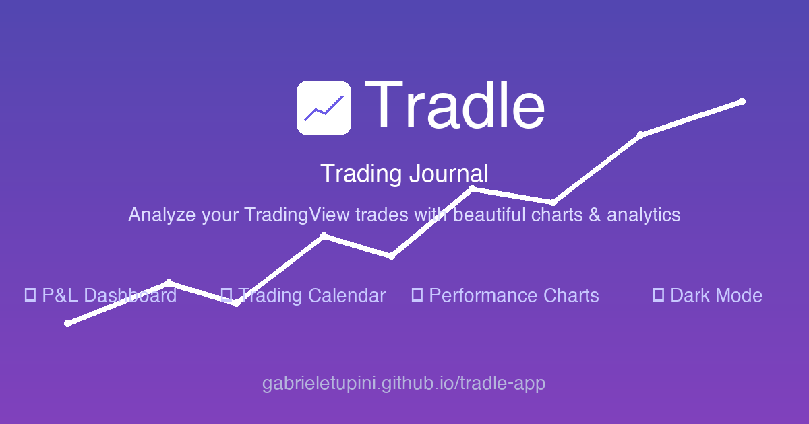

# 📈 Tradle — Trading Journal

A sleek, zero-dependency trading journal that runs entirely in your browser. Import your trades from **TradingView** or **Interactive Brokers**, track your P\&L, annotate trades with notes and screenshots, and sync everything across devices — all without a backend server or sign-up.

**[→ Open Tradle](https://gabrieletupini.github.io/tradle-app/)**



---

## ✨ Features

| | |
|---|---|
| 📊 **Dashboard** | Net & gross revenue, win rate, profit factor, expectancy, daily averages — all computed live |
| 📅 **Trading Calendar** | Monthly view with daily P\&L, color-coded wins/losses, and a configurable daily goal |
| 📓 **Trade Journal** | Notion-style per-day popup — free-text notes + per-trade annotations + screenshot attachments |
| 📸 **Screenshots** | Paste from clipboard or pick files; stored in IndexedDB (no 5 MB cap) |
| 📈 **Charts** | PnL evolution (All / 30D / 7D), commissions by day, win/loss distribution — powered by Chart.js |
| 🔍 **Trade History** | Sortable, searchable, paginated table with status filters |
| 💰 **Liquidity Tracker** | Set starting capital → see current liquidity & return % |
| 🔄 **Cross-Device Sync** | Journal, screenshots & CSVs sync via Firebase Realtime Database — zero config |
| 💾 **Backup & Restore** | One-click full export (trades + journal + screenshots) as JSON |
| 🌙 **Dark / Light Theme** | Toggle in the header; persisted across sessions |
| 📱 **Responsive** | Works on desktop, tablet & phone |

---

## 📂 Project Structure

```
tradle-app/
├── index.html                  ← single-page app entry point
├── package.json
├── README.md
│
├── css/
│   ├── style.css               ← main theme (light + dark)
│   └── responsive.css          ← mobile / tablet breakpoints
│
├── js/
│   ├── main.js                 ← TradleApp — orchestrator, DB, file pipeline
│   ├── ui.js                   ← UIController — DOM, charts, calendar, modals
│   ├── csvParser.js            ← multi-format CSV parser (TV + IBKR)
│   ├── tradeCalculator.js      ← trade matching, P&L, CONTRACT_SPECS
│   ├── imageStore.js           ← IndexedDB screenshot CRUD
│   └── firebaseSync.js         ← Firebase REST sync (journal, images, CSVs)
│
├── assets/
│   ├── icons/favicon.svg
│   └── images/og-image.png
│
├── data/
│   └── sample-data/            ← demo CSVs loaded on first visit
│       ├── paper-trading-order-history-2026-02-12.csv
│       └── ibkr-trade-report-2026-02-12.csv
│
├── tests/                      ← test & debug scripts
│   ├── fixtures/               ← test CSV files
│   └── *.js / *.html
│
├── scripts/
│   └── deploy.sh               ← production build & deploy
│
├── docs/
│   └── PERSISTENT_STORAGE_IMPLEMENTATION.md
│
├── .github/
│   └── workflows/
│       └── deploy.yml          ← GitHub Pages CI/CD
│
└── lighthouserc.json           ← Lighthouse CI config
```

---

## 🚀 Quick Start

```bash
# clone
git clone https://github.com/gabrieletupini/tradle-app.git
cd tradle-app

# install dev tools (optional — only needed for minification / Lighthouse)
npm install

# run locally
npm start          # opens http://localhost:3000
```

No build step required — just open `index.html` in any browser.

---

## 📥 Supported Import Formats

| Source | Format | Auto-Detect |
|--------|--------|-------------|
| **TradingView** Paper Trading | Order History CSV | ✅ |
| **Interactive Brokers** | Trade History CSV | ✅ |
| Custom format | — | 🔜 Coming soon |

---

## 🔢 Supported Futures Contracts

18 contracts across indices, energy, metals, bonds & currencies:

| Symbol | Name | Multiplier |
|--------|------|------------|
| ES1! | E-mini S\&P 500 | 50 |
| MES1! | Micro E-mini S\&P 500 | 5 |
| NQ1! | E-mini Nasdaq-100 | 20 |
| MNQ1! | Micro E-mini Nasdaq-100 | 2 |
| YM1! | E-mini Dow | 5 |
| MYM1! | Micro E-mini Dow | 0.50 |
| RTY1! | E-mini Russell 2000 | 50 |
| M2K1! | Micro E-mini Russell 2000 | 5 |
| CL1! | Crude Oil | 1 000 |
| MCL1! | Micro Crude Oil | 100 |
| GC1! | Gold | 100 |
| MGC1! | Micro Gold | 10 |
| SI1! | Silver | 5 000 |
| NG1! | Natural Gas | 10 000 |
| ZB1! | 30-Year T-Bond | 1 000 |
| ZN1! | 10-Year T-Note | 1 000 |
| 6E1! | Euro FX | 125 000 |
| 6J1! | Japanese Yen | 12 500 000 |

Unknown symbols gracefully fall back to multiplier = 1. Exchange prefixes (e.g. `CME_MINI:`) are stripped automatically.

---

## 🛠 Tech Stack

| Layer | Technology |
|-------|-----------|
| **UI** | Vanilla HTML / CSS / JS — zero frameworks |
| **Charts** | Chart.js (CDN) |
| **Icons** | Font Awesome 6 (CDN) |
| **Typography** | Google Fonts — Inter |
| **Local Storage** | `localStorage` (trades, journal notes, settings) |
| **Image Storage** | IndexedDB (screenshots — no 5 MB cap) |
| **Cross-Device Sync** | Firebase Realtime Database (REST, no SDK) |
| **Hosting** | GitHub Pages |
| **CI/CD** | GitHub Actions → auto-deploy on push |

**Dev tooling:** live-server · terser · uglifycss · html-minifier-terser · Lighthouse CI · html-validate

---

## 📄 License

MIT
